# SmartAccess - Detailed Electrical Circuit Diagram

This file contains the detailed pin configuration and Mermaid.js diagram for the SmartAccess ESP32 controller. You can copy the Mermaid code block below and import it directly into Draw.io via **Arrangement -> Insert -> Advanced -> Mermaid**.

## 1. Pin Connection Table

| External Device | Device Pin | ESP32 DevKit V1 Pin | Notes |
| :--- | :--- | :--- | :--- |
| **ILI9341 LCD (SPI)** | VCC | 3V3 | Display power |
| | GND | GND | Common ground |
| | CS | D15 (GPIO 15) | Chip Select |
| | RST | D4 (GPIO 4) | Reset |
| | D/C | D2 (GPIO 2) | Data / Command |
| | MOSI | D23 (GPIO 23) | SPI MOSI |
| | SCK | D18 (GPIO 18) | SPI Clock |
| | MISO | D19 (GPIO 19) | SPI MISO (Optional for read) |
| | LED | 3V3 | Backlight |
| **Relay Module** | VCC | VIN (5V) | Relay module power (5V from USB/External) |
| | GND | GND | Common ground |
| | IN | D12 (GPIO 12) | Relay control signal |
| | COM | VIN (5V / 12V Ext) | Shared power line for solenoid |
| | NO | Solenoid / LED (Door) | Powers the lock when active (Active High) |
| **Status Indicators** | WiFi LED (Blue) | D14 (GPIO 14) | Wired through 220Ω resistor to GND |
| | Reject LED (Red) | D26 (GPIO 26) | Wired through 220Ω resistor to GND |
| | Buzzer | D27 (GPIO 27) | Active buzzer signal pin (other pin to GND) |
| **Sensors & Inputs** | Exit Button | D13 (GPIO 13) | Push button to exit (INPUT_PULLUP) |
| | Door Sensor | D32 (GPIO 32) | Magnetic door sensor (INPUT_PULLUP) |

---

## 2. Mermaid.js Diagram for Draw.io

```mermaid
graph TD
    classDef esp32 fill:#1a1a1a,stroke:#333,stroke-width:2px,color:#fff;
    classDef display fill:#1d3557,stroke:#457b9d,stroke-width:2px,color:#fff;
    classDef relay fill:#e63946,stroke:#b11e31,stroke-width:2px,color:#fff;
    classDef sensor fill:#a8dadc,stroke:#457b9d,stroke-width:2px,color:#000;
    classDef output fill:#f1faee,stroke:#a8dadc,stroke-width:2px,color:#000;

    subgraph ESP32 ["ESP32 DevKit V1"]
        esp3V3["3V3 (Output)"]
        espVIN["VIN (5V Input/Output)"]
        espGND["GND (Common Ground)"]
        espD12["GPIO 12 (Relay Control)"]
        espD15["GPIO 15 (LCD CS)"]
        espD4["GPIO 4 (LCD RST)"]
        espD2["GPIO 2 (LCD D/C)"]
        espD23["GPIO 23 (LCD MOSI)"]
        espD18["GPIO 18 (LCD SCK)"]
        espD19["GPIO 19 (LCD MISO)"]
        espD14["GPIO 14 (WiFi Status LED)"]
        espD26["GPIO 26 (Reject LED)"]
        espD27["GPIO 27 (Buzzer Signal)"]
        espD13["GPIO 13 (Exit Button)"]
        espD32["GPIO 32 (Door Sensor)"]
    end
    
    class esp3V3,espVIN,espGND,espD12,espD15,espD4,espD2,espD23,espD18,espD19,espD14,espD26,espD27,espD13,espD32 esp32;

    subgraph LCD ["ILI9341 LCD 320x240 (SPI)"]
        lcdVCC["VCC"]
        lcdGND["GND"]
        lcdCS["CS"]
        lcdRST["RST"]
        lcdDC["D/C"]
        lcdMOSI["MOSI"]
        lcdSCK["SCK"]
        lcdMISO["MISO"]
        lcdLED["LED Backlight"]
    end
    class lcdVCC,lcdGND,lcdCS,lcdRST,lcdDC,lcdMOSI,lcdSCK,lcdMISO,lcdLED display;

    subgraph RELAY ["Relay Module & Lock Control"]
        relayVCC["VCC (5V)"]
        relayGND["GND"]
        relayIN["IN"]
        relayCOM["COM"]
        relayNO["NO (Normally Open)"]
        solenoid["Solenoid Door Lock (12V/5V External)"]
    end
    class relayVCC,relayGND,relayIN,relayCOM,relayNO relay;
    class solenoid output;

    subgraph Indicators ["Outputs & Buzzers"]
        ledWiFi["WiFi LED (Blue)"]
        ledReject["Reject LED (Red)"]
        resistorWiFi["Resistor 220Ω"]
        resistorReject["Resistor 220Ω"]
        buzzer["Active Buzzer"]
    end
    class ledWiFi,ledReject,buzzer output;
    class resistorWiFi,resistorReject sensor;

    subgraph Inputs ["Inputs (Switches)"]
        exitBtn["Exit Push Button"]
        doorMag["Magnetic Door Sensor"]
    end
    class exitBtn,doorMag sensor;

    %% Power distribution
    esp3V3 --> lcdVCC
    esp3V3 --> lcdLED
    espVIN --> relayVCC
    espVIN --> relayCOM
    espGND --- busGND[Common GND Line]
    busGND --> lcdGND
    busGND --> relayGND
    busGND --> ledWiFi
    busGND --> ledReject
    busGND --> buzzer
    busGND --> exitBtn
    busGND --> doorMag
    busGND --> solenoid

    %% SPI Communications
    espD15 --> lcdCS
    espD4 --> lcdRST
    espD2 --> lcdDC
    espD23 --> lcdMOSI
    espD18 --> lcdSCK
    espD19 --> lcdMISO

    %% Lock Trigger
    espD12 --> relayIN
    relayNO --> solenoid

    %% Indicators Routing
    espD14 --> resistorWiFi --> ledWiFi
    espD26 --> resistorReject --> ledReject
    espD27 --> buzzer

    %% Passive Inputs
    exitBtn --> espD13
    doorMag --> espD32
```

